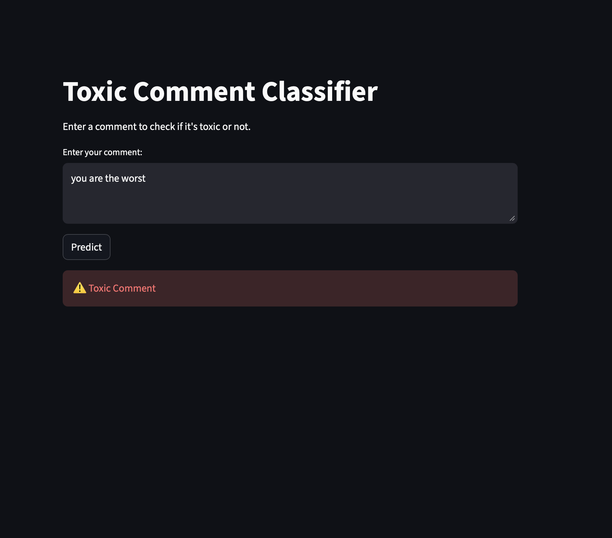

# 🧠 Toxic Comment Classifier

## 🚀 Overview
An end-to-end NLP project that classifies toxic comments using machine learning and provides real-time predictions through a Streamlit web application.

## ⚙️ Features
- Text preprocessing (cleaning, stopword removal)
- TF-IDF feature extraction
- Logistic Regression model
- Class imbalance handling (improved recall for toxic class)
- Interactive Streamlit UI

## 📊 Model Performance
- Accuracy: ~93%
- Toxic Class Recall: 86%
- Precision: 57%

> Optimized for higher recall to minimize missed toxic content in real-world moderation systems.

## 🛠️ Tech Stack
- Python
- Scikit-learn
- NLP (TF-IDF)
- Streamlit

## ▶️ Run Locally

```bash
pip install -r requirements.txt
streamlit run app.py

## 🖥️ Demo

